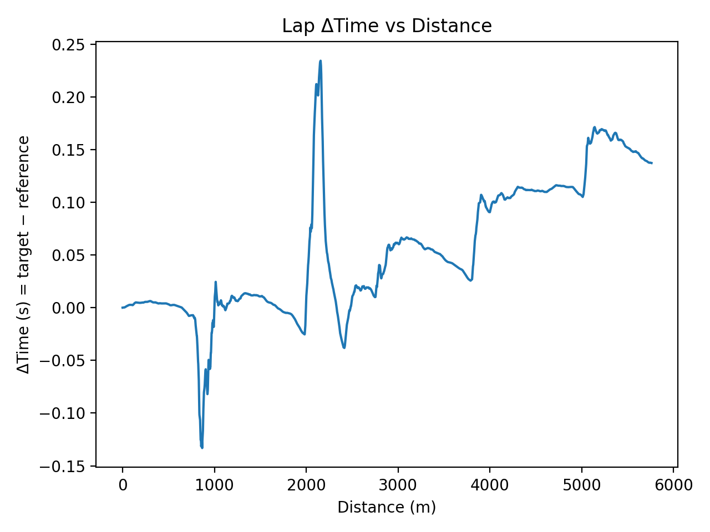
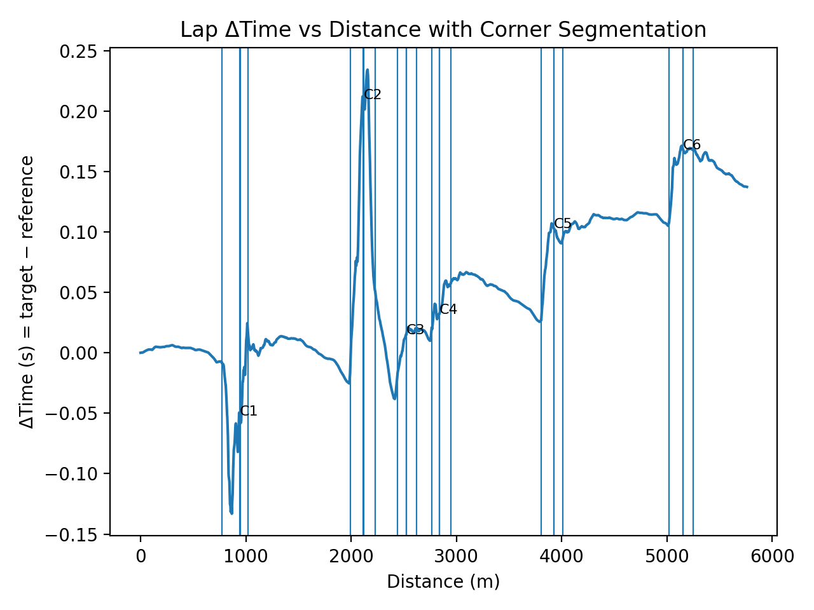
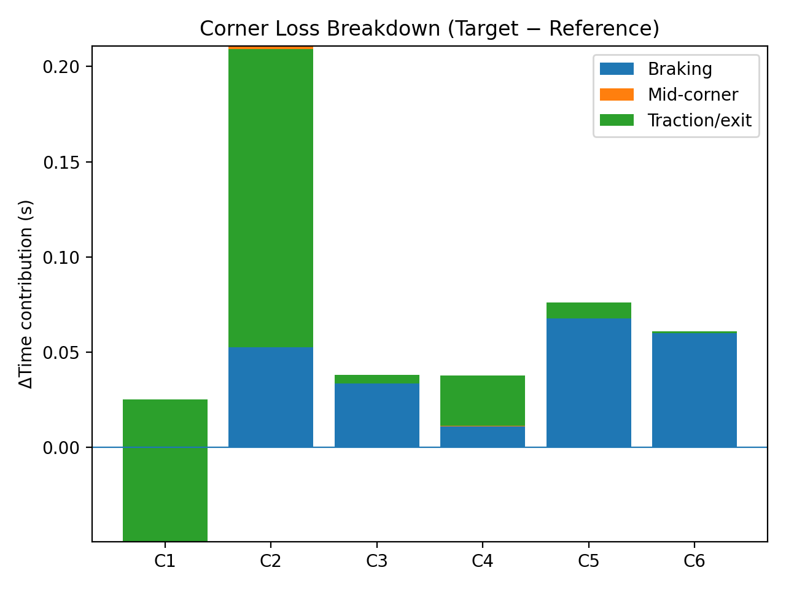

# F1 Lap Time Decomposition & Performance Attribution Engine

A lightweight performance-engineering tool that decomposes lap-time delta between two drivers into corner-level phases:
**braking → mid-corner → traction (exit)**, using public Formula 1 telemetry via FastF1.

This repo is designed as an F1-facing portfolio project: reproducible, tested, and focused on engineering value.

---

## What problem this solves (F1 context)

Given two laps in the same session (e.g., VER vs LEC in Monza 2023 Qualifying), we want to answer:

- **Where on track is time gained/lost?** (Δtime vs distance)
- **Which corners drive the delta?**
- For each corner, is the loss from:
  - **braking approach**
  - **mid-corner behavior**
  - **traction/exit**

This mirrors the first-pass analysis workflow used in race/performance engineering.

---

## Outputs

### 1a) Δtime vs distance (lap delta trace)



### 1b) Δtime vs distance with corner markers (brake / apex / throttle-on / exit)



Generated by:
```bash
python src/reports/plot_delta_with_segments.py
```
### 2) Corner segments (brake → apex → throttle-on → exit)
Generated by: `python src/reports/segments_table.py`  
Output: `reports/monza_2023q_ver_segments.csv`

### 3) Corner attribution table (3-phase)
Generated by: `python src/reports/attribution_table.py`  
Output: `reports/monza_2023q_attribution_v2_ver_vs_lec.csv`

**Important:** The current attribution sums over defined corner windows (brake→exit) and therefore does **not** represent a full-lap partition. A later step can add “unattributed straights/other” to close the accounting.

### 4) Corner loss breakdown (stacked by phase)



This view summarizes **where lap time is lost or gained per corner**, split into:
- braking
- mid-corner
- traction / exit

This visualization mirrors typical **corner-by-corner debrief slides** used in performance engineering.
---

## Method overview (engineering view)

1. **Data ingestion** (FastF1)
   - Pull fastest lap telemetry for selected drivers in a given session.

2. **Canonical resampling**
   - Telemetry is resampled onto a uniform **distance grid** (default: 1m).
   - This makes per-point comparisons stable and reproducible.

3. **Lap delta computation**
   - Compute Δtime(distance) = time_target − time_reference.

4. **Phase detection**
   - Braking zones detected via brake flag (with merging + minimum length filtering).

5. **Corner segmentation**
   - For each braking zone:
     - `brake_start`
     - `apex` = min speed in a search window
     - `throttle_on` = first stable throttle application after apex
     - `exit_end` = braking end + exit window, capped to avoid overlap

6. **Attribution**
   - For each corner segment, compute Δtime at the key distances and split into:
     - braking loss
     - mid-corner loss
     - traction loss

7. **Interpretation note**
    - Positive Δtime values indicate the target driver is slower than the reference at that point on track. Negative braking or traction losses indicate time
    gained relative to the reference.

---

## Quickstart

### Setup
```bash
python -m venv .venv
source .venv/Scripts/activate  # Git Bash on Windows
pip install -r requirements.txt
pip install -e .
pre-commit install
```
### Run pipeline
``` bash
python src/data/pull_fastf1_pair.py
python src/reports/plot_delta_time.py
python src/reports/segments_table.py
python src/reports/attribution_table.py
```

### Run tests
``` bash
pytest -q
```
### Run the full pipeline (CLI)
``` bash
python src/cli/run_pipeline.py --year 2023 --gp Italy --session Q --ref VER --tgt LEC --out-tag monza_2023q_ver_vs_lec
```

## Steps
- Create virtual environment
- Install dependencies
- Pull sample laps
- Generate delta plot
- Generate segments and attribution
- Run tests

## Key artifacts
- reports/delta_time_vs_distance.png — Δtime trace
- reports/monza_2023q_ver_segments.csv — corner segments (includes throttle_on)
- reports/monza_2023q_attribution_v2_ver_vs_lec.csv — 3-phase attribution table

## Repo structure
- src/data/ — FastF1 ingestion scripts
- src/telemetry/ — resampling, delta, phases, segments, attribution
- src/reports/ — report scripts
- tests/ — unit tests for core logic
- reports/ — generated artifacts used in README

## Design decisions
- Distance-based resampling for stability
- Explicit heuristics for interpretability
- Strict quality gates (ruff, black, pre-commit, pytest)
- Modular design for future replacement with higher-fidelity models

## Validation & Engineering Guarantees

- Unit-tested core primitives:
    - distance-based resampling
    - braking zone detection
    - segment non-overlap
    - attribution conservation (sum of phases = segment loss)

- Deterministic results:
    - fixed distance grid
    - no stochastic components

- Numerical stability:
    - tolerances (1e-6) used to avoid floating-point artefacts

- Known limitations:
    - public telemetry granularity
    - heuristic phase boundaries
    - interpolation effects on absolute lap delta

## Dashboard

A lightweight Streamlit viewer is included for browsing generated runs:
``` bash
    streamlit run dashboard.py
```

## Disclaimer
- This project uses public telemetry and simplified heuristics.
- It is intended as a technical demonstration, not a substitute for internal F1 tools or proprietary data.